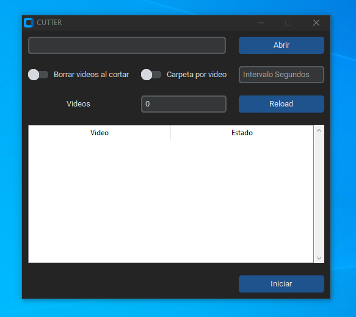

# Cutter
Un programa en Python que utiliza CustomTkinter y OpenCV para extraer fotogramas de un video.

[Live Demo](https://vimeo.com/1023758336?share=copy)

> Nota: si no se especifican intervalos de segundos, por defecto se usará un intervalo de 1 segundo.
